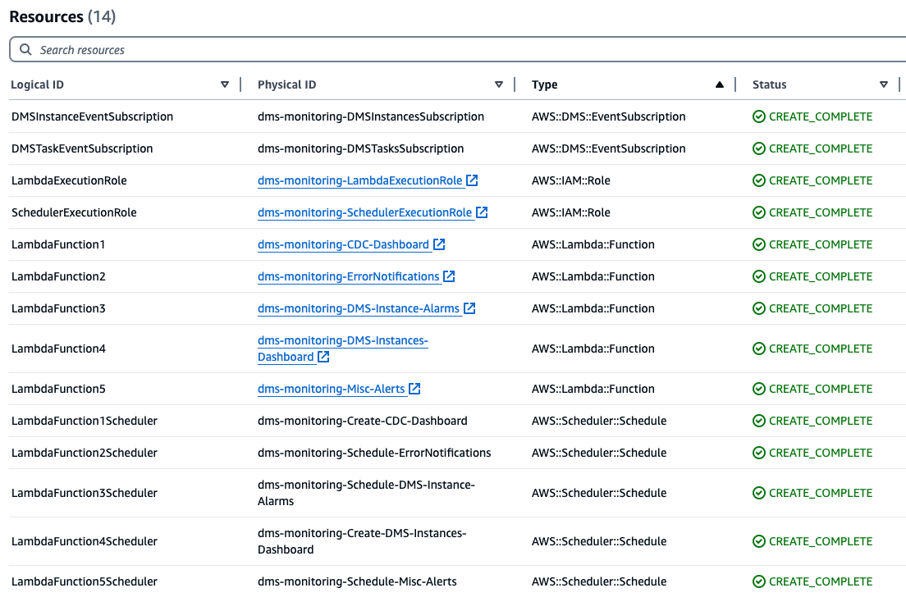

# Runbook-AWS-DMS-Monitoring

## Overview

This runbook provides detailed instructions on the automated monitoring solution developed for AWS Database Migration Service (DMS). The solution is implemented using Amazon Lambda using Python and AWS SDKs, automating several key monitoring and alerting tasks for entire fleet of DMS resources. The primary focus is on creating a consolidated monitoring and alerting setup to ensure the health and performance of DMS replication instances and tasks.

**This run book deploys following monitoring -**

1. Centralized Amazon CloudWatch dashboard to review resource consumption (e.g, CPU, Memory, Storage utilizations or Capacity utilization for DMS Serverless etc.) by all AWS DMS Classic Instances. 
2. Centralized Amazon CloudWatch dashboard to review CDC (Change Data Capture) Metrics like Source Latency, Target Latency etc. from all DMS tasks.
3. Setup AWS DMS event notifications (Including change of state like stop, start, fail etc. for all DMS Instances & tasks) for all AWS DMS classic Instances and tasks.
4. Setup hourly Amazon CloudWatch alerts for Errors & Warnings in all AWS DMS migrations including AWS DMS Classic, homogenous migration or DMS Serverless. Users can customize the notification frequency.
5.	Setup alerts for AWS DMS Instances to notify when breach thresholds.
6. Setup AWS DMS best practices alerts for DMS Instances and DMS task. For example, script will alert if there are DMS instances with public access enabled or unused  DMS Classic Instances or DMS task with debug logging enabled.

All monitoring placed by the solution are fully customizable where users can choose the CloudWatch metrics or task log filtering for special events.

## Prerequisites

1. DMS Instances, tasks are already deployed.
2. Amazon Simple Notification Service (SNS) topic already setup for sending notification to users.
3. Amazon Simple Storage Service ( S3) bucket to store deployment scripts.
4. AWS Identity and Access Management (IAM) permissions to create new role & deploy solution. As part of this solution, two new Amazon IAM roles will be created:
 
   - %-LambdaExecutionRole
   
       Permissions:
      -   "dms:Describe*",
      -   "logs:DescribeLogGroups",
      -   "logs:DescribeLogStreams",
      -   "logs:FilterLogEvents",
      -   "cloudwatch:PutMetricAlarm",
      -   "cloudwatch:PutDashboard",
      -   "sns:Publish"

    -  %-SchedulerExecutionRole

       Permissions:
       - "lambda:InvokeFunction"

## Implementation

1. Clone this repository to local machine or download scripts from the script folder of this project. The script folder contains python zip files  for Amazon Lambda functions. It also has Amazon CloudFormation template for one-click deployment of entire solution. 
2. Upload downloaded python zip files to your Amazon S3 bucket. This Amazon S3 bucket location will be used to deploy solution using Amazon CloudFormation. Makes sure Amazon S3 bucket is in the same region as of your AWS DMS resources.
3. Deploy CloudFormation stack download in step1. Stack will deploy following resources :

 

Refer to complete runbook for step by step guidance.  [Runbook](DMS_Monitoring_Runbook.pdf)

## Clean up

Delete Amazon CloudFormation stack to remove all resources deployed as part of this solution.

## Security
See CONTRIBUTING for more information.

## License
This library is licensed under the MIT-0 License. See the LICENSE file.
