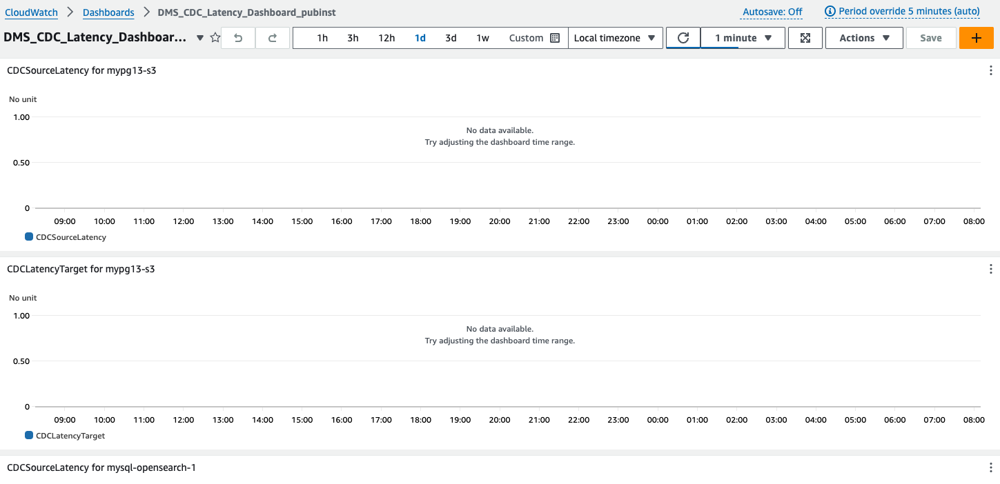
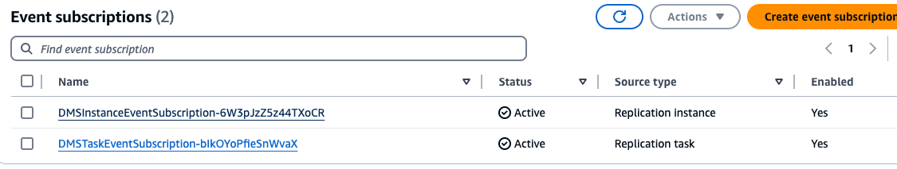
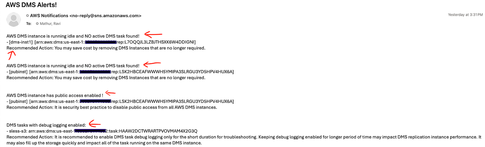

# Runbook-AWS-DMS-Monitoring

## Overview

This runbook provides detailed instructions on the automated monitoring solution developed for AWS Database Migration Service (DMS). The solution is implemented using Amazon Lambda using Python and AWS SDKs, automating several key monitoring and alerting tasks for entire fleet of DMS resources. The primary focus is on creating a consolidated monitoring and alerting setup to ensure the health and performance of DMS replication instances and tasks.

**This run book deploys following monitoring -**

1. Centralized Amazon CloudWatch dashboard to review resource consumption (e.g, CPU, Memory, Storage utilizations or Capacity utilization for DMS Serverless etc.) by all AWS DMS Classic Instances. 
2. Centralized Amazon CloudWatch dashboard to review CDC (Change Data Capture) Metrics like Source Latency, Target Latency etc. from all DMS tasks.
3. Setup AWS DMS event notifications (Including change of state like stop, start, fail etc. for all DMS Instances & tasks) for all AWS DMS classic Instances and tasks.
4. Setup hourly Amazon CloudWatch alerts for Errors & Warnings in all AWS DMS migrations including AWS DMS Classic, homogenous migration or DMS Serverless. Users can customize the notification frequency.
5.	Setup alerts for AWS DMS Instances to notify when breach thresholds.
6. Setup AWS DMS best practices alerts for DMS Instances and DMS task. For example, script will alert if there are DMS instances with public access enabled or unused  DMS Classic Instances or DMS task with debug logging enabled.

All monitoring placed by the solution are fully customizable where users can choose the CloudWatch metrics or task log filtering for special events.

## Prerequisites

1. DMS Instances, tasks are already deployed.
2. Amazon Simple Notification Service (SNS) topic already setup for sending notification to users.
3. Amazon Simple Storage Service ( S3) bucket to store deployment scripts.
4. AWS Identity and Access Management (IAM) permissions to create new role & deploy solution. As part of this solution, two new Amazon IAM roles will be created:
 
   - %-LambdaExecutionRole
   
       Permissions:
      -   "dms:Describe*",
      -   "logs:DescribeLogGroups",
      -   "logs:DescribeLogStreams",
      -   "logs:FilterLogEvents",
      -   "cloudwatch:PutMetricAlarm",
      -   "cloudwatch:PutDashboard",
      -   "sns:Publish"

    -  %-SchedulerExecutionRole

       Permissions:
       - "lambda:InvokeFunction"

## Implementation

1. Clone this repository to local machine or download scripts from the script folder of this project. The script folder contains python zip files  for Amazon Lambda functions. It also has Amazon CloudFormation template for one-click deployment of entire solution. 
2. Upload downloaded python zip files to your Amazon S3 bucket. This Amazon S3 bucket location will be used to deploy solution using Amazon CloudFormation. Makes sure Amazon S3 bucket is in the same region as of your AWS DMS resources.
3. Deploy CloudFormation stack download in step1. Stack will deploy following resources :

 

## Clean up

Delete Amazon CloudFormation stack to remove all resources deployed as part of this solution.

## Appendix

**1.  Centralized Amazon CloudWatch dashboard for AWS DMS Replication Instances**

Objective:

To provide a consolidated view of key metrics (CPU, Memory, Swap, and CapacityUtilization) for all AWS DMS replication instances.

Steps:

* A Python script leverages the AWS SDK (Boto3) to query CloudWatch metrics for each DMS replication instance.
* The script creates a CloudWatch dashboard that includes widgets for:
    * CPU Utilization: Tracks the percentage of CPU resources used.
    * Freeable Memory: Shows the amount of memory available for the replication instance.
    * Swap Usage: Displays the swap memory usage.
    * CapacityUtilization: Monitors the percentage of memory used by the DMS serverless replication.

Outcome:

A single CloudWatch dashboard with a consolidated view of critical metrics for each replication instance, enabling quick assessment of resource utilization and potential bottlenecks.

 

**2. Centralized Amazon CloudWatch dashboard for DMS task CDC Metrics**

Objective:

To monitor and consolidate the Change Data Capture (CDC) lag metrics across all DMS tasks associated with each replication instance.

Steps:

* The Python script fetches CDC metrics (CDCSourceLatency and CDCLatencyTarget) for each DMS task. 
* You can also select your own set of metrics to monitoring via Lambda parameter input.
* A separate CloudWatch dashboard is  created to displaying these task metrics for each instance.

Outcome:

A consolidated view of CDC lag metrics, enabling real-time monitoring of data replication delays, helping in proactive management of data consistency and synchronization.

  

**3. CloudFormation Template for DMS Instance and Task Event Subscription**

Objective:

To automate the creation of event subscriptions for DMS instances and tasks using AWS CloudFormation.

Steps:

* A CloudFormation template is provided to create event subscriptions for AWS DMS instances and tasks.
* The event subscriptions allow users to receive notifications for important events like task failures, replication instance issues, and more.

Outcome:

Automated deployment of event subscriptions ensures that users are promptly notified of any critical events affecting their DMS tasks and instances, enabling faster response times to issues.

  

**4. CloudWatch Alerts for Errors and Warnings in DMS Tasks**

Objective:

To set up automated alerts for errors and warnings detected in DMS tasks, ensuring that potential issues are quickly identified and addressed.

Steps:

* A Python script scans the CloudWatch logs for error and warning messages related to DMS tasks.
* CloudWatch alarms are configured to trigger SNS notifications whenever an error or warning is detected.
* The alarms can be fine-tuned to match specific log patterns or keywords indicative of issues in DMS tasks.
* By default, script scheduled on AWS EventBridge scheduler to run every hour. Users can customize the frequency.

Outcome:

Alerts for errors and warnings in DMS tasks enable quick identification and resolution of issues, minimizing downtime and ensuring smooth operation of data migration tasks.

  

**5. DMS Instances and DMS tasks best practice alerts**

Objective:

To identify and alert users on few best practices. For example, this will alert user if there are DMS Instance with public access enabled or DMS task with debug logging enabled or DMS Instance running without any active task on it.

Steps:

* The Python script checks the activity and resource utilization of DMS classic instances.
* Alerts are sent via SNS to notify users about these instances, allowing for manual review and take necessary actions.
* By default, script scheduled on AWS EventBridge scheduler to run every hour. Users can customize the frequency.

Outcome:

Automated monitoring and alerts for unused DMS classic instances lead to better resource management and cost savings by preventing unnecessary charges for idle instances.

 

## Security
See CONTRIBUTING for more information.

## License
This library is licensed under the MIT-0 License. See the LICENSE file.